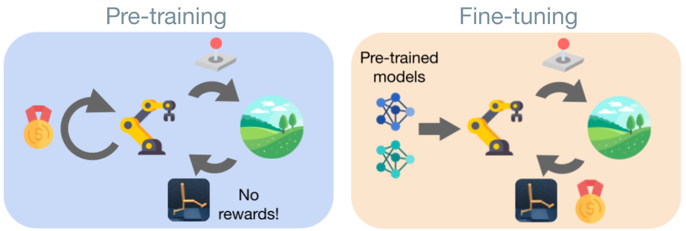

# Mastering the Unsupervised Reinforcement Learning Benchmark from Pixels
[[website](https://masteringurlb.github.io/)] [[paper](https://arxiv.org/abs/2209.12016)]

This is the code for our ICML 2023 work. You can use it to pre-train world model-based agents with different unsupervised strategies, fine-tune the agent's components selectively, and use planning (Dyna-MPC) during fine-tuning. The repo also contains an extensively tested DreamerV2 implementation in PyTorch.

<p align="center">
    
</p>

If you find the code useful, please refer to our work using:
```
@inproceedings{
        Rajeswar2023MasterURLB,
        title={Mastering the Unsupervised Reinforcement Learning Benchmark from Pixels},
        author={Sai Rajeswar and Pietro Mazzaglia and Tim Verbelen and Alexandre Piché and Bart Dhoedt and Aaron Courville and Alexandre Lacoste},
        booktitle={40th International Conference on Machine Learning},
        year={2023},
        url={https://arxiv.org/abs/2209.12016}
}
```

## Requirements
The environment assumes you have access to a GPU that can run CUDA 10.2 and CUDNN 8. Then, the simplest way to install all required dependencies is to create an anaconda environment by running
```sh
conda env create -f conda_env.yml
```
After the instalation ends you can activate your environment with
```sh
conda activate urlb
```

## Implemented Agents
| Agent | Command
|---|---|
| DreamerV2 (supervised) | `agent=dreamer` 
| ICM | `agent=icm_dreamer` 
| Plan2Explore | `agent=plan2explore` 
| RND | `agent=rnd_dreamer` 
| LBS | `agent=lbs_dreamer` 
| APT | `agent=apt_dreamer` 
| DIAYN | `agent=diayn_dreamer` 
| APS | `agent=aps_dreamer` 

## Domains and tasks
We support the following domains and tasks.
| Domain | Tasks |
|---|---|
| `walker` | `stand`, `walk`, `run`, `flip` |
| `quadruped` | `walk`, `run`, `stand`, `jump` |
| `jaco` | `reach_top_left`, `reach_top_right`, `reach_bottom_left`, `reach_bottom_right` |

## Instructions
### Pre-training
To run pre-training use the `dreamer_pretrain.py` script
```sh
python dreamer_pretrain.py configs=dmc_pixels agent=icm_dreamer domain=walker seed=1
```
If you want to train a skill-based agent, e.g. DIAYN, just change the `agent` and run:
```sh
python dreamer_pretrain.py configs=dmc_pixels agent=diayn_dreamer domain=walker seed=1
```
This script will produce several agent snapshots after training for `100k`, `500k`, `1M`, and `2M` frames. The snapshots will be stored under the following directory:
```sh
./pretrained_models/<obs_type>/<domain>/<agent>/<seed>
```
For example:
```sh
./pretrained_models/pixels/walker/icm/
```

### Fine-tuning
Once you have pre-trained your method, you can use the saved snapshots to initialize the `Dreamer` agent and fine-tune it on a downstream task. For example, let's say you have an agent pre-trained with `ICM`, you can fine-tune it on `walker_run` by running the following command:
```sh
python dreamer_finetune.py configs=dmc_pixels agent=icm_dreamer task=walker_run snapshot_ts=1000000 seed=1
```
This will load a snapshot stored in `./pretrained_models/pixels/walker/icm_dreamer/1/snapshot_1000000.pt`, initialize `Dreamer` with it, and start training on `walker_run` using the extrinsic reward of the task.

You can ablate components by setting: `init_critic=True/False` and `init_actor=True/False`. 

You can use Dyna-MPC by setting: `mpc=True`.

### Monitoring

#### Console
The console output is also available in a form:
```
| train | F: 6000 | S: 3000 | E: 6 | L: 1000 | R: 5.5177 | FPS: 96.7586 | T: 0:00:42
```
a training entry decodes as
```
F  : total number of environment frames
S  : total number of agent steps
E  : total number of episodes
R  : episode return
FPS: training throughput (frames per second)
T  : total training time
```

#### Tensorboard
Logs are stored in the `exp_local` folder. To launch tensorboard run:
```sh
tensorboard --logdir exp_local
```

#### Weights and Bias (wandb)
You can also use Weights and Bias, by launching the experiments with `use_wandb=True`.


## Notes and acknowledgements

The codebase was adapted from [URLB](https://github.com/rll-research/url_benchmark).
The Dreamer implementation follows the original Tensorflow [DreamerV2 codebase](https://github.com/danijar/dreamerv2). 
This re-implementation has been carefully tested to obtain consistent results with the original ones on the DeepMind Control Suite, as reported in [this paper](https://arxiv.org/abs/2107.09645).